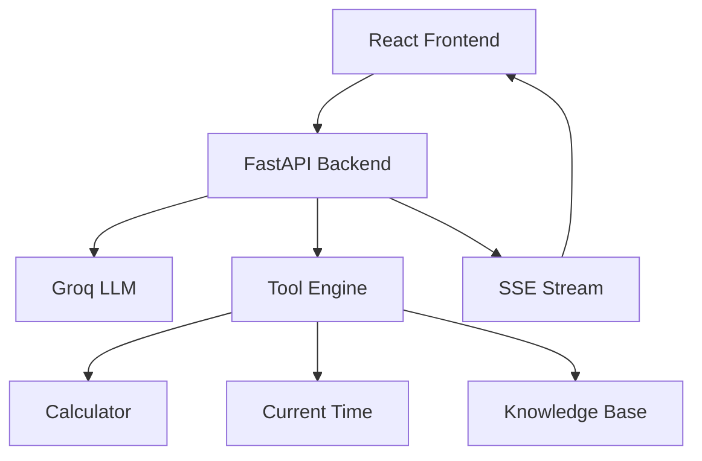

# Streaming LLM Tool Visualizer

Streaming LLM Tool Visualizer is a full-stack demonstration application for observing how an AI assistant streams responses in real time, triggers tools, and presents intermediate reasoning to a user. The project combines a FastAPI backend with a React frontend to showcase modern AI agent workflows through Server-Sent Events (SSE), tool execution visualization, and context monitoring.

## 1. Project Objective

This project exists to provide a clear and interactive view of LLM-driven workflows in real time. It allows users to:

- Visualize LLM responses token-by-token
- Observe tool execution as it happens
- Demonstrate AI agent workflows
- Monitor conversation context and token usage
- Support conversation summarization
- Showcase a modern full-stack AI application architecture

## 2. Features

- Real-time LLM streaming
- Server-Sent Events (SSE)
- Calculator tool
- Current time tool
- Knowledge base search
- Tool execution visualization
- Token monitoring
- Conversation compression
- Docker support
- Automated testing
- Error handling

## 3. Tech Stack

### Frontend

- React
- Vite
- Zustand
- JavaScript

### Backend

- FastAPI
- Python 3.10.11

### AI

- Groq API
- Llama 3.3 70B Versatile
- Sentence Transformers
- tiktoken

### Tools

- asteval
- Server-Sent Events (SSE)

### Testing

- Pytest
- Vitest
- React Testing Library

### Containerization

- Docker
- Docker Compose

## 4. Project Architecture

The application follows a simple request flow: the React frontend sends a chat request to the FastAPI backend, the backend routes the request to either the LLM or a tool execution pipeline, and the results are streamed back to the UI over SSE. The frontend updates the display progressively so the user can watch the assistant response and tool activity unfold.



The backend is responsible for request handling, error handling, tool orchestration, and streaming response generation. The frontend is responsible for rendering the streamed content, tool call blocks, and metadata such as token counts. This separation keeps the interface responsive while allowing the backend to manage AI and tool interactions centrally.

## 5. Project Structure

```text
streaming-llm-tool-visualizer/

├── backend/
│   ├── app/
│   ├── tests/
│   └── requirements.txt
│
├── frontend/
│   ├── src/
│   ├── tests/
│   └── package.json
│
├── docker-compose.yml
├── .env.example
├── submission.json
└── README.md
```

- `backend/` contains the FastAPI application, request handlers, tool services, and backend tests.
- `frontend/` contains the React application, UI components, stream client, and frontend tests.
- `docker-compose.yml` defines the local containerized setup for backend and frontend services.
- `.env.example` documents the environment variables that should be copied into `.env`.
- `submission.json` contains the evaluation payload placeholder used for submission workflows.

## 6. Installation

### Prerequisites

Ensure the following are installed on your machine:

- Python 3.10.11
- Node.js LTS
- Docker Desktop
- Git

## 7. Environment Variables

Copy the example environment file to a local `.env` file before starting the application:

```bash
cp .env.example .env
```

Use values appropriate for your environment. The example file includes placeholders and should never contain real secrets.

Example:

```env
GROQ_API_KEY=your_api_key_here
BACKEND_PORT=8000
FRONTEND_PORT=5173
BACKEND_URL=http://localhost:8000/
FRONTEND_URL=http://localhost:5173/
MODEL_NAME=llama-3.3-70b-versatile
```

## 8. Running Locally

### Backend

```bash
cd backend
python -m venv .venv
pip install -r requirements.txt
uvicorn app.main:app --reload
```

The backend will be available at:

- http://localhost:8000
- http://localhost:8000/docs

### Frontend

```bash
cd frontend
npm install
npm run dev
```

The frontend will be available at:

- http://localhost:5173

## 9. Running with Docker

From the repository root, start the services with:

```bash
docker compose up --build
```

The frontend and backend will be available at the URLs above. To stop the containers:

```bash
docker compose down
```

## 10. API Endpoints

| Endpoint              | Method | Description                                                        |
| --------------------- | ------ | ------------------------------------------------------------------ |
| `/health`             | GET    | Returns a simple health-check response for the backend service.    |
| `/api/chat/test`      | POST   | Sends a simple chat message to the backend and returns a response. |
| `/api/chat/stream`    | POST   | Streams chat responses and tool events over Server-Sent Events.    |
| `/api/chat/summarize` | POST   | Produces a concise summary of the conversation history.            |

## 11. Tool Overview

### Calculator

The calculator tool is triggered when the user asks for an arithmetic expression such as a numeric calculation. It evaluates the expression and returns the result to the UI.

### Current Time

The current time tool is triggered when the user asks for the current time or UTC time. It returns a timestamp payload that is displayed in the chat interface.

### Knowledge Base

The knowledge base tool is triggered when the user asks about the Atlas project or other knowledge-base topics. It retrieves relevant content from the built-in knowledge base and presents it as a tool result.

## 12. Testing

### Backend

```bash
cd backend
pytest
```

### Frontend

```bash
cd frontend
npx vitest run
```

Optional coverage commands:

```bash
cd backend
pytest --cov=app

cd frontend
npx vitest run --coverage
```


## 13. Future Enhancements

Potential improvements for the project include:

- Additional tools for richer agent workflows
- Multi-agent orchestration
- Authentication and user accounts
- Persistent chat history
- Improved retrieval and RAG quality

## 14. License

This project is licensed under the MIT License. See the LICENSE file for details.
